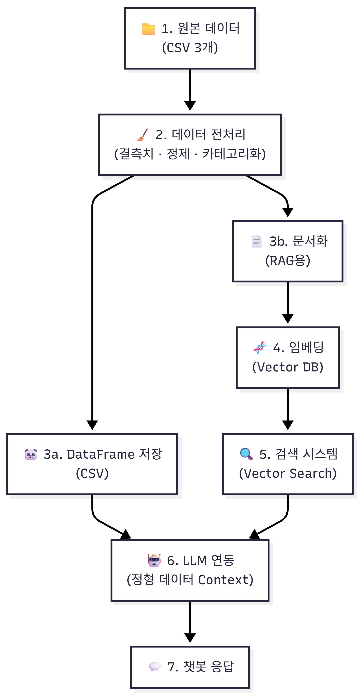

# 온누리상품권 가맹점 안내 챗봇

## 🚀 실행 방법

### 1. 환경 설정
```bash
python -m venv venv
source venv/bin/activate  # Windows: venv\Scripts\activate
pip install -r requirements.txt
```

### 2. 데이터 준비
1. 공공데이터포털에서 다음 데이터 다운로드:
   - 소상공인시장진흥공단_전국_온누리상품권_가맹점_현황
   - 소상공인시장진흥공단_온누리상품권_지역별_회수현황
   - 소상공인시장진흥공단_온누리상품권_지역별_판매현황

2. `/` 폴더에 CSV 파일 저장

### 3. 전처리 및 벡터 DB 구축
```bash
# 노트북 순서대로 실행
jupyter notebook

# 실행 순서:
# 1. notebooks/01_data_exploration.ipynb
# 2. notebooks/02_preprocessing.ipynb
# 3. src/search_engine.py
# 4. src/rag_setup.py  ⚠️ 10-20분 소요, API 비용 약 $0.30

```

### 4. 앱 실행
```bash
streamlit run app.py
```

## ⚠️ 주의사항

### 벡터 DB (vectordb/chroma_db/)
- 용량: 약 500MB~1GB
- Git에 포함되지 않음
- 재구축 필요: `04_rag_setup.py` 실행
- 소요 시간: 10-20분
- API 비용: 약 $0.30

### OpenAI API 키 필요
```bash
# .env 파일 생성
OPENAI_API_KEY=your_api_key_here
```

## 📁 프로젝트 구조
```
chatbot_project/
├─ .vscode/	# VS Code 설정 파일 (디버그, 워크스페이스 설정 등)
│
├─ docs/	# 프로젝트 문서 (기획서, 설계 문서, 정리 노트 등)
│
├─ notebooks/	# EDA, 전처리, 실험용 Jupyter Notebook
│	# (ipynb 단계에서 검증 후 src 코드로 이전)
│ ├─ 01_data_exploration.ipynb	# 기본통계량 확인
│ └─ 02_preprocessing.ipynb	# 전처리 및 정제된 데이터 생성+테스트
├─ page/	# Streamlit 멀티페이지 UI 구성 디렉터리
│ ├─   pycache  /	# Python 캐시 파일 (자동 생성)
│ ├─   init  .py	# page 패키지 인식용
│ ├─ intro.pswp	# 임시 파일 (편집기 백업 파일로 보임)
│ ├─ intro.py	# 서비스 소개 / 메인 설명 페이지
│ ├─ project1.py	# 프로젝트 1 페이지 (Streamlit UI)
│ ├─ project2.py	# 프로젝트 2 페이지 (Data flow)
│ └─ project3.py	# 프로젝트 3 페이지 (챗봇 페이지)
│
├─ src/	# 핵심 비즈니스 로직 (UI와 분리)
 
│ ├─   pycache  /	# Python 캐시 파일
│ ├─ utils/	# 공통 유틸 함수 및 상수
│ │ ├─   pycache  /	# Python 캐시 파일 (자동 생성)
│ │ ├─ project2_desc.py.pswp	# 임시 파일 (편집기 백업 파일로 보임)
│ │ ├─ project1_desc.py	# 프로젝트 1 페이지 설명글
│ │ ├─ project2_desc.py	# 프로젝트 2 페이지 설명글
│ │ ├─ project3_desc.py	# 프로젝트 3 페이지 설명글
│ │ └─   init  .py	# utils 패키지 인식용
│ │
│ ├─   init  .py	# src 패키지 인식용
│ ├─ chatbot.py	# 사용자 질의 처리 메인 로직
│ │	(LLM 호출, 프롬프트 구성, 응답 생성)
│ ├─ rag_setup.py	# RAG 파이프라인 구성
│ │	(임베딩, 벡터DB 로딩, 유사도 검색(similarity search) 테스트 및 k값 조정)
│ └─ search_engine.py	# 검색 로직
│	(키워드 검색, 벡터 검색, 하이브리드 검색)
│
├─ vectordb/	# 벡터 데이터베이스 저장 디렉터리
│	# (FAISS / Chroma / 기타 로컬 벡터 저장소)
│
├─ .env	# 환경 변수 파일 (API Key, 경로 등)
│
├─ .gitignore	# Git 추적 제외 파일 목록
│
├─ api_keys.txt	# API 키 보관 파일 (실서비스에서는 사용 비권장)
│
├─ app.py	# Streamlit 앱 메인 엔트리 포인트
│	# (단일 페이지 또는 기본 실행용)
│
├─ app_multipage.py	# Streamlit 멀티페이지 실행 진입점
│	# page 디렉터리와 연결
│
├─ multipage.py	# 멀티페이지 라우팅 / 페이지 관리 로직
│
├─ area_onnuri.csv	# 온누리상품권 원본 데이터
│
├─ cleaned_onnuri.csv	# 전처리 완료된 온누리 데이터
│
├─ README.md	# 프로젝트 개요, 구조 설명, 실행 방법
│
└─ requirements.txt	# Python 패키지 의존성 목록
```
## 📊 데이터 플로우



## 🏗️ 시스템 아키텍처

