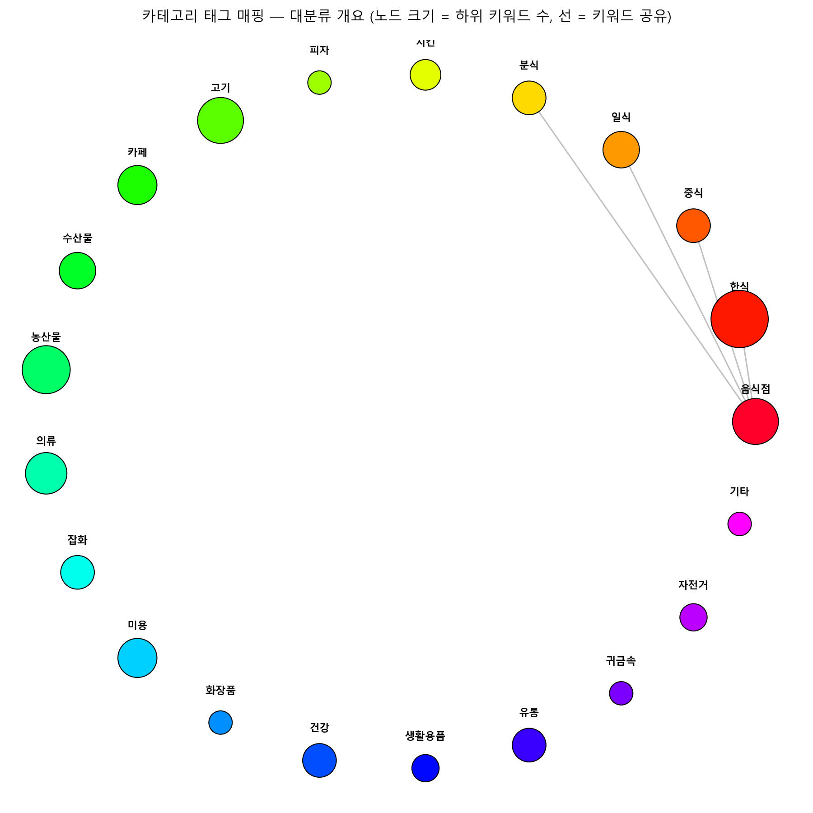
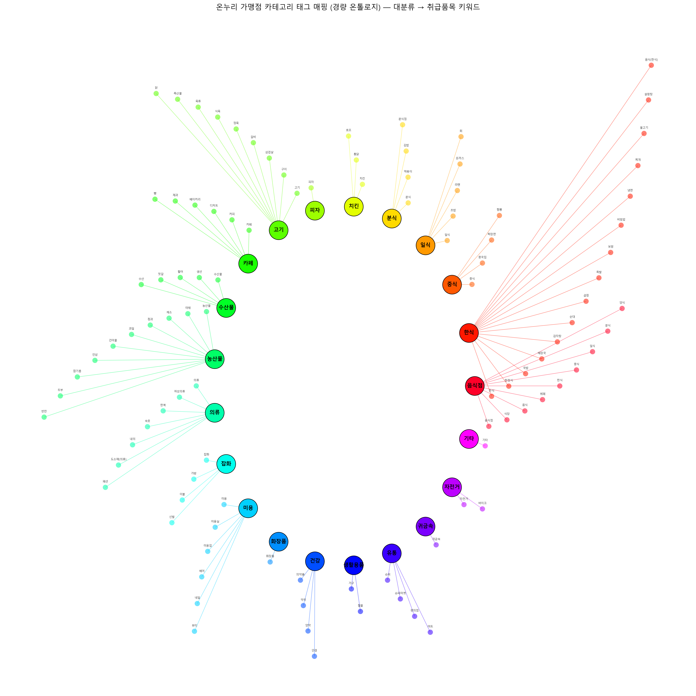
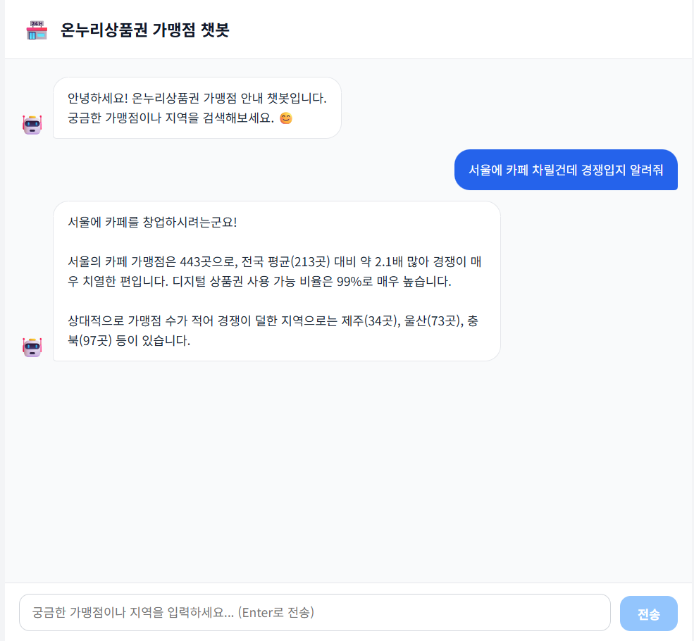

> **현재 리팩토링 진행중입니다.**

# 온누리상품권 가맹점 안내 챗봇

전국 온누리상품권 가맹점 데이터를 기반으로 자연어 질문에 답변하는 AI 챗봇 웹 애플리케이션입니다.  
LangGraph ReAct Agent + Gemini 2.5 Flash LLM을 활용하며, React SPA 프론트엔드와 FastAPI 백엔드로 구성됩니다.

백엔드 배포 url: https://chatbotproject-production-d8e0.up.railway.app/docs

프론트엔드 배포 url: https://chatbot-project-seven-ruddy.vercel.app/

---

## 주요 기능

| 기능 | 설명 |
|------|------|
| **AI 챗봇** | 지역·업종·디지털/지류 조건 검색, 자연어 유사도 검색, 상품권 정책 FAQ, 창업 입지 경쟁도 분석 |
| **PDF 보고서 생성** | 조건 필터링 후 가맹점 목록과 차트(막대·파이)가 포함된 PDF 다운로드 |
| **데이터 인사이트** | 전국 17개 시도 가맹점 수·판매·회수 통계 대시보드 (Recharts) |
| **아키텍처 뷰어** | 시스템 아키텍처 및 DataFlow 다이어그램 + 요청 처리 흐름 설명 |
| **질문 가이드** | 챗봇에서 사용 가능한 질문 유형 예시 안내 |
| **사용자 매뉴얼** | 서비스 전체 사용 방법 안내 |

---

## 기술 스택

### 프론트엔드
- **React 18** — SPA 구성
- **Vite 5** — 빌드 도구 및 개발 서버
- **Recharts** — 데이터 시각화 (막대·선·파이 차트)
- **CSS Modules** — 컴포넌트별 스코프 스타일링

### 백엔드
- **FastAPI** — REST API 서버
- **Uvicorn** — ASGI 서버
- **Pydantic** — 요청/응답 데이터 검증
- **pandas** - 정형 데이터 검색/필터링

### AI / LLM
- **LangGraph** (`create_react_agent`) — Tool-calling ReAct Agent 구성
- **LangChain** — LLM 추상화, 벡터스토어 연동
- **Google Gemini 2.5 Flash Lite** — LLM (langchain-google-genai)
- **OpenAI text-embedding-3-small** — 가맹점 텍스트 임베딩
- **sentence-transformers (CrossEncoder)** — 검색 결과 재순위화 (`cross-encoder/ms-marco-MiniLM-L-6-v2`)

### 데이터 / 저장
- **Pandas** — 정형 데이터 필터링 및 통계
- **ChromaDB** — 로컬 벡터 데이터베이스 (MMR 검색)
- **CSV** — 전처리된 온누리 가맹점 원본 데이터

### 보고서
- **fpdf2** — PDF 생성 (한국어 맑은 고딕 폰트)
- **Matplotlib** — 업종별 막대 차트 및 가맹 유형 파이 차트

### 개발 도구
- **Jupyter Notebook** — 데이터 탐색 및 전처리 실험
- **python-dotenv** — 환경 변수 관리

---

## 디렉토리 구조

```
chatbot_project/
├── backend/                    # FastAPI 서버
│   ├── main.py                 # 앱 초기화, CORS, 라우터 등록
│   └── routers/
│       ├── chat.py             # POST /api/chat  — 챗봇 응답
│       └── report.py           # GET  /api/report — PDF 보고서 생성
│
├── frontend/                   # React SPA (Vite)
│   ├── src/
│   │   ├── App.jsx             # 루트 컴포넌트, 페이지 라우팅
│   │   ├── components/
│   │   │   ├── Sidebar.jsx     # 사이드바 내비게이션
│   │   │   └── Chat.jsx        # 챗봇 UI (메시지 버블, 입력창)
│   │   └── pages/
│   │       ├── Manual.jsx          # 사용자 매뉴얼
│   │       ├── QuestionGuide.jsx   # 질문 유형 가이드
│   │       ├── Architecture.jsx    # DataFlow / 시스템 아키텍처
│   │       ├── DataInsights.jsx    # 데이터 인사이트 대시보드
│   │       └── Report.jsx          # 보고서 생성 (PDF 다운로드)
│   ├── index.html
│   └── package.json
│
├── src/                        # 핵심 비즈니스 로직
│   ├── chatbot.py              # LangGraph ReAct Agent + 4개 Tool 정의
│   ├── llm_config.py           # Gemini LLM / OpenAI Embeddings 설정
│   ├── search_engine.py        # 지역·시장명·복합 검색 함수, 통계 함수
│   ├── rag_setup.py            # ChromaDB 벡터DB 구축 스크립트
│   └── utils/
│       ├── project1_desc.py    # 프로젝트 설명 텍스트
│       ├── project2_desc.py
│       └── project3_desc.py
│
├── notebooks/
│   ├── 01_data_exploration.ipynb   # 기본 통계량 확인 및 EDA
│   └── 02_preprocessing.ipynb      # 전처리 및 cleaned_onnuri.csv 생성
│
├── vectordb/chroma_db/         # ChromaDB 벡터 데이터베이스 (git 제외)
├── docs/                       # 아키텍처 다이어그램, 실행 화면 이미지
│
├── cleaned_onnuri.csv          # 전처리 완료 가맹점 데이터 (~15만 건)
├── area_onnuri.csv             # 지역별 가맹점 요약 데이터
├── 가맹점_현황.csv              # 공공데이터 원본
├── 판매_현황.csv                # 지역별 연도별 판매 현황 원본
├── 회수_현황.csv                # 지역별 연도별 회수 현황 원본
│
├── .env                        # API 키 환경 변수 (git 제외)
├── requirements.txt            # Python 패키지 목록
└── README.md
```

---

## 시스템 아키텍처

```
[사용자 브라우저]
      │  React SPA (Vite :5173)
      │
      ▼
[FastAPI 백엔드 (:8000)]
      ├── POST /api/chat   →  src/chatbot.py
      │                        │
      │                   LangGraph ReAct Agent
      │                        ├── Tool 1: pandas_filter
      │                        │     └── cleaned_onnuri.csv (Pandas)
      │                        ├── Tool 2: rag_search
      │                        │     ├── Query Rewrite (LLM이 질문 재작성)
      │                        │     ├── vectordb/chroma_db (ChromaDB, k=10 유사도 검색)
      │                        │     └── CrossEncoder Reranker → 상위 3개 반환
      │                        ├── Tool 3: faq_answer
      │                        │     └── 인라인 FAQ DB
      │                        └── Tool 4: market_analysis
      │                              └── cleaned_onnuri.csv 집계 (Pandas)
      │                   Gemini 2.5 Flash (LLM 최종 응답)
      │
      └── GET  /api/report  →  backend/routers/report.py
                                └── Pandas 필터 + Matplotlib 차트 + fpdf2 PDF
```

### 챗봇 요청 처리 흐름

1. React UI 질문 입력 → `POST /api/chat`
2. LangGraph Agent가 질문 유형 분석 → 적합한 Tool 선택
3. Tool 실행 (Pandas 필터링 / ChromaDB 유사도 검색 / FAQ 매칭 / 입지 경쟁도 분석)
4. Gemini 2.5 Flash가 Tool 결과를 바탕으로 자연어 답변 생성
5. JSON 응답 → React 채팅 버블 렌더링

### Agent Tool 구성

| Tool | 역할 | 사용 시점 |
|------|------|-----------|
| `pandas_filter` | 지역·품목·디지털/지류 조건 정형 필터링, 통계 집계 | 구체적인 조건 검색, 개수 질문 |
| `rag_search` | Query Rewrite로 질문 재작성 → ChromaDB 벡터 유사도 검색(k=10) → CrossEncoder 재순위화 → 상위 3개 반환 | "분위기 좋은 카페" 등 자연어 묘사 |
| `faq_answer` | 상품권 정책·사용법·규정 FAQ | 유효기간, 환불, 할인율, 구입처 등 |
| `market_analysis` | 지역·업종 입지 경쟁도 분석 (가맹점 수, 전국 평균 대비 포화도, 디지털 비율) | "이 지역에 카페 차리면 어때?", "경쟁이 심한가요?" 등 창업 입지 질문 |

---

## RAG 파라미터 튜닝 실험 결과

> 실험 스크립트: `experiments/chunk_tuning.py` | 결과 데이터: `experiments/chunk_experiment.csv`

### 실험 조건

| 파라미터 | 테스트 값 | 고정값 |
|----------|-----------|--------|
| `chunk_size` | 500 / 1000 / 2000 | — |
| `k` (검색 문서 수) | 5 / 10 | — |
| `lambda_mult` (MMR 다양성) | — | **0.7** |
| 샘플 문서 수 | — | 5,000건 |
| 임베딩 모델 | — | `gemini-embedding-001` |

### 정확도 측정 기준

각 조합마다 고정 질문 5개를 실행하고, 검색된 문서가 해당 기준을 만족하는 비율을 정확도로 계산했습니다.

| 질문 | 정확도 판별 기준 |
|------|-----------------|
| "서울 음식점" | `소재지`에 "서울" 포함 |
| "경기 자전거 매장" | `소재지`에 "경기" 포함 |
| "디지털 가능한 카페" | `디지털형 가맹 여부 == Y` |
| "분위기 좋은 한식집" | `취급품목`에 한식 관련 키워드 포함 |
| "부산 카페" | `소재지`에 "부산" 포함 |

### 실험 결과

| chunk_size | k | 서울 음식점 | 경기 자전거 | 디지털 카페 | 한식집 | 부산 카페 | **평균** |
|:---:|:---:|:---:|:---:|:---:|:---:|:---:|:---:|
| 500 | **5** | 100% | 80% | 100% | 100% | 80% | **92%** |
| 500 | 10 | 90% | 90% | 100% | 100% | 70% | 90% |
| 1000 | **5** | 100% | 80% | 100% | 100% | 80% | **92%** |
| 1000 | 10 | 90% | 90% | 100% | 100% | 70% | 90% |
| 2000 | **5** | 100% | 80% | 100% | 100% | 80% | **92%** |
| 2000 | 10 | 90% | 90% | 100% | 100% | 70% | 90% |

### 변경 전/후 비교

| 설정 | chunk_size | chunk_overlap | k |
|------|:---:|:---:|:---:|
| **변경 전** (`rag_setup.py` 기존) | 1000 | 200 | 10 |
| **변경 후** (실험 결과 채택) | 500 | 100 | **5** |

| 질문 | 변경 전 (1000/k=10) | 변경 후 (500/k=5) | 변화 |
|------|:---:|:---:|:---:|
| 서울 음식점 | 90% | **100%** | +10% |
| 경기 자전거 매장 | 90% | 80% | -10% |
| 디지털 가능한 카페 | 100% | **100%** | 0% |
| 분위기 좋은 한식집 | 100% | **100%** | 0% |
| 부산 카페 | 70% | **80%** | +10% |
| **평균** | 90% | **92%** | **+2%** |

> **chunk_size 단독 효과 없음**: 가맹점 1건 텍스트가 평균 ~120자로 짧아 500·1000·2000 모두 실질 청킹이 일어나지 않아 chunk_size 변경에 따른 정확도 차이는 없었음.  
> **실질 개선 요인은 k 감소 (10 → 5)**: k가 작을수록 상위 유사도 문서만 반환되어 지역 일치율이 올라감. 서울·부산 쿼리에서 각 +10%p 개선, 평균 +2%p 상승.  
> 경기 자전거는 k=5에서 -10%p이지만, 검색 정밀도와 다양성 간 트레이드오프이며 평균 기준으로는 k=5가 우위.

### 결론 및 채택 파라미터

**채택: `chunk_size=500`, `chunk_overlap=100`, `k=5`, `lambda_mult=0.7`** (평균 정확도 92%, k=10 대비 +2%p)

---

## RAGAS 기반 rag_search Tool 품질 평가

> 평가 스크립트: `experiments/ragas_eval.py` | 결과 데이터: `experiments/ragas_result.csv`

### 왜 RAGAS인가

위 `chunk_tuning.py` 실험은 "검색된 문서의 지역·키워드가 정답 조건을 포함하는가"라는 **규칙 기반 정확도**만 측정할 수 있었습니다. 하지만 `rag_search` Tool은 "분위기 좋은 한식집", "조용히 혼밥하기 좋은 곳"처럼 **정답이 하나로 딱 떨어지지 않는 자연어 질문**을 다루기 때문에, 규칙 기반 채점만으로는 "검색 결과에 실제로 근거해서 답했는가", "질문과 관련 있는 내용을 답했는가" 같은 응답 품질을 판단할 수 없었습니다.

RAGAS를 채택한 이유는 다음과 같습니다.

1. **LLM-as-judge 자동 평가** — 사람이 매 질문·답변을 채점하지 않아도 LLM이 대신 채점하므로, 대량의 자유형 질문에도 정량적 점수를 낼 수 있습니다.
2. **RAG 경로를 단계별로 분리 진단** — "검색이 정확한가(context_precision)", "필요한 정보를 다 가져왔는가(context_recall)", "검색 결과에 없는 내용을 지어내진 않았는가(faithfulness)", "질문과 관련된 답을 했는가(answer_relevancy)"를 각각 따로 측정해, 문제가 **검색 단계**에 있는지 **답변 생성 단계**에 있는지 구분할 수 있습니다.
3. **기존 스택 재사용** — `src/llm_config.py`의 `get_llm()`, `get_embeddings()`(`GoogleGenerativeAIEmbeddings`)를 RAGAS의 `LangchainLLMWrapper` / `LangchainEmbeddingsWrapper`로 그대로 감싸서 채점자로 재사용했습니다. 별도 평가 인프라나 다른 모델을 추가로 붙일 필요가 없습니다. (평가 LLM은 `get_llm()`이 반환하는 모델을 그대로 따라가며, 현재는 `gemini-3.1-flash-lite`입니다.)
4. **chunk_tuning.py 실험을 보완** — chunk_tuning이 "검색 파라미터(k, chunk_size) 튜닝"에 초점을 맞췄다면, RAGAS 평가는 그 위에서 실제 사용자에게 나가는 **최종 자연어 응답의 품질**을 검증하는 상위 레벨 평가로 채택했습니다.

### 평가 방법

Agent 전체(`create_react_agent`)를 거치면 `pandas_filter` 등 다른 Tool로 분기될 수 있어, `rag_search` 경로만 분리해서 평가합니다.

1. `rag_search` Tool을 직접 호출해 벡터 검색 결과(context)를 얻는다.
2. 검색 결과만 근거로 LLM(`get_llm()`)이 최종 답변을 생성한다. (Agent의 "도구 결과를 자연스럽게 요약" 단계 재현)
3. (질문, 답변, context, reference) 조합을 RAGAS 4개 지표로 채점한다.
4. 질문 하나를 처리·채점할 때마다 바로 `ragas_result.csv`에 append — 무료 티어 일일 한도 때문에
   중간에 실패해도 그 전까지 채점된 질문은 파일에 남는다.

질문도 한 번에 하나씩만 순차 처리하고, API 호출 사이마다 `SLEEP_SECONDS`(5초)만큼 대기해
순간 요청량을 최소화한다 (무료 티어 레이트리밋 대응).

| 항목 | 값 |
|------|-----|
| 평가 대상 | `rag_search` Tool (RAG 경로) |
| LLM (답변 생성·채점) | `src.llm_config.get_llm()` (현재 `gemini-3.1-flash-lite`) |
| 임베딩 | `GoogleGenerativeAIEmbeddings` (`gemini-embedding-001`) |
| 지표 | faithfulness, answer_relevancy, context_precision, context_recall |

### 평가 지표 설명

| 지표 | 한 줄 요약 | 상세 설명 |
|------|-----------|----------|
| **context_precision** | 검색이 정확한가 | 검색된 문서들이 실제로 정답과 관련 있는 문서인지를 측정합니다. 관련 없는 문서가 섞여 있을수록 낮아집니다. |
| **context_recall** | 필요한 정보를 다 가져왔는가 | 정답에 필요한 정보가 검색 결과에 포함되어 있는지를 측정합니다. 필요한 근거를 빠뜨릴수록 낮아집니다. |
| **faithfulness** | 검색 결과에 없는 내용을 지어내진 않았는가 | 생성된 답변의 각 문장이 검색된 컨텍스트로 실제 뒷받침되는 비율입니다. 컨텍스트에 없는 내용을 답변에 포함할수록 낮아집니다. |
| **answer_relevancy** | 질문과 관련된 답을 했는가 | 생성된 답변이 원래 질문에 얼마나 관련 있는지를 측정합니다. 질문과 동떨어진 내용을 답할수록 낮아집니다. |

### 평가 질문 3개

| # | 질문 |
|---|------|
| 1 | 분위기 좋은 한식집 추천해줘 |
| 2 | 서울에서 디지털 상품권 되는 카페 알려줘 |
| 3 | 조용히 혼밥하기 좋은 곳 |

> `reference`(context_recall/precision 계산용 정답)는 retriever(k=5, mmr)가 실제로
> 반환하는 상위 문서의 상호명·지역·품목을 그대로 반영해 작성한 골든셋입니다
> (`ragas_eval.py`의 `REFERENCES`). vectordb·retriever 설정이 바뀌면 재확인이 필요합니다.

### 실행 결과

`gemini-3.1-flash-lite` 기준, 3개 질문 모두 처리 완료. `answer_relevancy`는 이 모델이
한 번의 호출에서 다중 candidate를 생성하지 못해 `AnswerRelevancy(strictness=1)`로
후보 1개만 생성하도록 낮춰서 계산했습니다.

| 질문 | faithfulness | answer_relevancy | context_precision | context_recall |
|------|:---:|:---:|:---:|:---:|
| 분위기 좋은 한식집 추천해줘 | 0.000 | 0.753 | 0.0 | 1.0 |
| 서울에서 디지털 상품권 되는 카페 알려줘 | 0.500 | 0.860 | 0.0 | 1.0 |
| 조용히 혼밥하기 좋은 곳 | 0.250 | 0.000 | 0.0 | 1.0 |
| **평균** | **0.250** | **0.538** | **0.0** | **1.0** |

**해석 및 한계**

- **context_recall = 1.0**: `REFERENCES`를 구체적인 상호명·지역 골든셋으로 다시 쓰자 0.0 → 1.0으로 바뀌었습니다. 검색이 필요한 정보를 실제로 다 가져오고 있다는 뜻입니다.
- **context_precision = 0.0**: context_recall이 1.0인 걸 보면 검색 자체의 문제는 아니고, legacy `context_precision` 지표가 각 검색 결과를 reference와 비교해 랭킹 순서를 매기는 방식 자체의 특성으로 보입니다. 원인은 아직 명확히 파악하지 못해 추가 조사가 필요합니다.
- **answer_relevancy**: 0.753 / 0.860 / 0.0 (평균 0.538). 세 번째 질문("조용히 혼밥하기 좋은 곳")에서는 챗봇이 "혼밥 분위기 정보는 검색 결과에 없다"고 사실대로 회피 답변을 해서 관련도가 0으로 나왔습니다 — 이는 hallucination을 피한 결과이므로 faithfulness 관점에선 오히려 바람직한 동작입니다.
- **faithfulness**: 0.0 / 0.5 / 0.25 (평균 0.25) — 생성된 답변 문장이 검색된 컨텍스트로 실제 뒷받침되는 비율입니다. 세 질문 모두 컨텍스트에 없는 "분위기" 관련 서술을 답변에 섞어서 낮게 나오는 경향이 있습니다. 답변 프롬프트에서 "검색 결과에 없는 내용은 지어내지 마세요"를 더 강하게 강제하면 개선 여지가 있어 보입니다.

---

## 온톨로지 기반 카테고리 계층 구조 설계

> 매핑 정의: `src/category_taxonomy.py` | 시각화 스크립트: `experiments/visualize_ontology.py`

### 배경

`취급품목` 컬럼은 22,113개의 자유 입력 텍스트로, "한식" / "음식(한식)" / "중식" / "분식"처럼 표기가 제각각입니다. 기존에는 `str.contains(category)` 단순 문자열 포함 검색만 사용해서, "음식점"으로 검색하면 정확히 "음식점"이라는 문자열이 들어간 값만 잡히고 "한식"·"중식"·"분식" 등 실제로는 음식점에 속하는 값은 빠지는 문제가 있었습니다. 또한 `chatbot.py`에 6개 항목짜리 매핑이 있었지만 `search_engine.py`와 공유되지 않아 도구마다 검색 결과가 달랐습니다.

그래프 DB(Neo4j/RDF)를 새로 두기보다, 기존 pandas/ChromaDB 구조를 그대로 두고 바로 적용 가능한 **경량 카테고리 태그 매핑**을 선택했습니다.

### 설계

- 실제 데이터의 상위 빈도 취급품목(`value_counts` 상위권)을 기준으로 **대분류 21개 → 하위 원본 키워드 리스트** 형태의 매핑을 사람이 직접 구성 (`CATEGORY_EXPANSIONS: dict[str, list[str]]`).
- `expand_category(term)` 함수가 사용자가 입력한 category를 관련 키워드 전체로 확장해서 검색.
- 매핑에 없는 term은 원본 그대로 반환(fallback)해 기존 동작과 호환.

### 적용 위치

- `chatbot.py`의 `pandas_filter`, `market_analysis` Tool, `extract_area_category()` 헬퍼
- `search_engine.py`의 `statistics()` 함수
- `str.contains(..., regex=False)` 명시 — 키워드에 괄호가 포함된 값(`음식(한식)`, `도소매(의류)`)이 정규식 그룹으로 잘못 해석되어 매칭이 깨지는 문제를 함께 수정.

### 효과 (필터링 매칭 건수 변화)

| category | 적용 전 (단순 substring) | 적용 후 (계층 확장) |
|---|---:|---:|
| 음식점 | 3,132 | 23,226 |
| 한식 | 13,427 | 15,287 |
| 카페 | 858 | 5,055 |
| 고기 | 839 | 8,682 |
| 미용 | 4,390 | 5,204 |
| 자전거 | 98 | 100 |

`chunk_tuning.py` 실험의 "chunk_size는 효과가 없고 k가 실질적 개선 요인이었다"는 결론과 별개로, 검색 **재현율(recall)** 을 끌어올리는 지점은 벡터 파라미터가 아니라 이 카테고리 매핑 쪽이었습니다 — "음식점" 검색이 3,132건에서 23,226건으로 늘어난 게 그 예시입니다.

### 시각화

<p align="center">
  
</p>
<p align="center"><sub>대분류 개요 그래프 — 노드 크기는 하위 키워드 수, 선은 키워드를 공유하는 대분류 간 연결(예: 음식점 ↔ 한식/중식/일식/분식)</sub></p>

<p align="center">
  
</p>
<p align="center"><sub>전체 그래프 — 대분류(큰 노드) → 취급품목 키워드(작은 노드) 스포크 레이아웃</sub></p>

---

## RAG 고도화: Query Rewrite + CrossEncoder Reranker

> 적용 위치: `src/chatbot.py`의 `rag_search` Tool

### 배경

사용자의 질문은 "강남에 고기집 추천해줘"처럼 짧고 구어체인 경우가 많은데, 이런 표현은 임베딩 공간에서 가맹점 데이터(상호명·주소·취급품목 위주 텍스트)와 정확히 매칭되지 않을 수 있습니다. 또한 벡터 유사도만으로 뽑은 상위 문서 순서가 실제 관련성 순서와 항상 일치하지는 않는다는 한계가 있습니다. 이 두 문제를 각각 **검색 전 쿼리 보강(Query Rewrite)** 과 **검색 후 재정렬(Reranking)** 로 완화했습니다.

### Query Rewrite

**왜 썼는가 (문제)**: `rag_search`는 임베딩 기반 벡터 검색인데, 사용자의 질문("강남에 고기집 추천해줘")은 짧고 구어체인 반면 벡터DB 문서는 상호명·주소·취급품목 위주의 정형 텍스트입니다. 두 표현의 어휘가 겹치지 않으면("고기집" vs 문서 안의 "삼겹살", "정육식당") 유사도 점수가 낮게 나와 관련 있는 가맹점이 검색에서 빠질 수 있습니다.

**해결한 문제**: 어휘 불일치로 인한 **재현율(recall) 저하**

`rag_search` 호출 직후, LLM(`rewrite_query()` / `QUERY_REWRITE_PROMPT`)이 사용자의 자연어 질문을 벡터 검색에 유리한 구체적 쿼리로 재작성합니다.

- 지역명·업종 키워드를 구체적으로 확장하고, "온누리상품권 가맹점" 같은 맥락 키워드를 덧붙이도록 프롬프트로 유도합니다.
- 재작성이 실패하면(LLM 오류 등) 원본 쿼리로 폴백해 검색이 끊기지 않도록 했습니다.
- 실행 시 콘솔에 `🔍 Query Rewrite: '원본' → '재작성'` 로그를 남겨 동작을 바로 확인할 수 있습니다.

**적용 전/후**

| 단계 | 쿼리 |
|---|---|
| 적용 전 | "강남에 고기집 추천해줘" (그대로 임베딩) |
| 적용 후 | "서울 강남 지역 고기 구이 삼겹살 갈비 온누리상품권 가맹점 추천" |

재작성된 쿼리는 문서의 실제 표기(고기, 구이, 삼겹살 등)와 겹치는 단어가 늘어나 벡터 유사도 매칭 확률이 올라갑니다.

### CrossEncoder Reranker

**왜 썼는가 (문제)**: ChromaDB 벡터 검색(bi-encoder 방식)은 쿼리와 문서를 각각 독립적으로 임베딩한 뒤 코사인 유사도로 비교하기 때문에 빠르지만, 쿼리와 문서를 함께 보고 정교하게 관련성을 판단하지는 못합니다. 그래서 상위 k개 순서가 실제 관련도 순서와 미묘하게 어긋날 수 있습니다(예: 주소만 비슷하고 업종은 안 맞는 문서가 위로 올라오는 경우).

**해결한 문제**: 벡터 유사도 상위권의 **정밀도(precision) 저하** — 1차 검색은 넉넉히(k=10) 뽑아 재현율을 확보하고, CrossEncoder가 쿼리-문서 쌍을 직접 보고 재점수화해 진짜 관련 있는 것만 상위로 올립니다.

1. `vectorstore.similarity_search`로 재작성된 쿼리에 대해 후보 **k=10**개를 가져옵니다.
2. `cross-encoder/ms-marco-MiniLM-L-6-v2` (`sentence-transformers.CrossEncoder`)가 `(쿼리, 가맹점 문서)` 쌍마다 관련성 점수를 매깁니다.
3. 점수 내림차순으로 정렬해 **상위 3개**만 최종 반환합니다.

**적용 전/후**

| 단계 | 동작 |
|---|---|
| 적용 전 | 벡터 유사도만으로 top-k(원래 k=5, MMR) 그대로 반환 |
| 적용 후 | 벡터 유사도로 top-10 후보 확보 → CrossEncoder가 (쿼리, 문서) 쌍 재점수화 → 상위 3개만 반환 |

### 전체 흐름

```
사용자 질문 → Query Rewrite (LLM) → ChromaDB 유사도 검색 (k=10)
           → CrossEncoder 재순위화 → 상위 3개 → Agent 최종 응답 생성
```

### 전/후 RAGAS 비교 평가

> 평가 스크립트: `experiments/ragas_comparison.py` | 결과 데이터: `experiments/ragas_comparison.csv`

`ragas_eval.py`와 동일한 질문 3개를 두 가지 검색 경로로 각각 실행해 비교했습니다.

- **Mode A (before)**: Query Rewrite/Reranker 적용 전의 기존 구현 재현 — `vectorstore.as_retriever(search_type="mmr", search_kwargs={"k": 5, "lambda_mult": 0.7})`로 top-5를 그대로 반환 (커밋 `b659338` 시점 `rag_search`).
- **Mode B (after)**: 현재 `rag_search` — `rewrite_query()` → `similarity_search(k=10)` → CrossEncoder 재순위화 → 상위 3개.

두 모드 모두 동일한 `ANSWER_PROMPT`로 답변을 생성해 검색 파이프라인 차이만 분리 측정했습니다. `reference`(골든셋)는 특정 모드의 검색 결과(상호명)에 치우치지 않도록, 질문이 요구하는 조건(지역·업종·상품권 형태)을 서술하는 방식으로 다시 작성했습니다(`ragas_eval.py`의 상호명 나열 방식과 차이점).

> 평가 도중 `rewrite_query()`가 Gemini의 `content`(list[dict] 형태)를 `.strip()`하려다 매번 `AttributeError`로 실패해 원본 쿼리로 조용히 폴백하던 버그를 이번에 발견해 함께 수정했습니다(`src/chatbot.py`) — 수정 전에는 Mode B가 사실상 "리랭커만 적용"된 상태로 측정될 뻔했습니다.

**질문별 상세**

| 질문 | 지표 | Mode A (before) | Mode B (after) |
|---|---|:---:|:---:|
| 분위기 좋은 한식집 추천해줘 | faithfulness | 0.600 | 0.000 |
| | answer_relevancy | 0.753 | 0.750 |
| | context_precision | 0.0 | 0.0 |
| | context_recall | 0.0 | 0.0 |
| 서울에서 디지털 상품권 되는 카페 알려줘 | faithfulness | 0.000 | 1.000 |
| | answer_relevancy | 0.856 | 0.893 |
| | context_precision | 0.0 | 0.0 |
| | context_recall | 0.5 | 0.5 |
| 조용히 혼밥하기 좋은 곳 | faithfulness | 0.000 | 0.000 |
| | answer_relevancy | 0.749 | 0.787 |
| | context_precision | 0.0 | 0.0 |
| | context_recall | 0.5 | 0.0 |

**전체 평균**

| 지표 | Mode A (before) | Mode B (after) | Δ (B−A) |
|---|:---:|:---:|:---:|
| faithfulness | 0.2000 | 0.3333 | ▲ +0.1333 |
| answer_relevancy | 0.7859 | 0.8099 | ▲ +0.0241 |
| context_precision | 0.0000 | 0.0000 | － +0.0000 |
| context_recall | 0.3333 | 0.1667 | ▼ −0.1667 |
| **평균** | **0.3298** | **0.3275** | ▼ −0.0023 |

**해석 및 한계**

- **answer_relevancy·faithfulness는 개선**: 세 질문 모두 answer_relevancy가 소폭 상승했고, 특히 "서울에서 디지털 상품권 되는 카페 알려줘"는 faithfulness가 0.0 → 1.0으로 크게 개선됐습니다. Query Rewrite로 어휘가 보강되고 Reranker가 관련성 낮은 문서(예: "스터디카페 공유")를 걸러내면서, 생성된 답변이 검색 컨텍스트에 더 충실해진 것으로 보입니다.
- **context_recall은 오히려 하락**: "조용히 혼밥하기 좋은 곳"에서 0.5 → 0.0으로 떨어져 전체 평균을 끌어내렸습니다. Reranker가 top-10 후보를 top-3로 좁히는 과정에서, 골든셋이 요구하는 업종 폭(한식·분식·일식 등)에 맞는 문서가 컷오프됐을 가능성이 있습니다 — **재현율과 정밀도의 트레이드오프**가 실측으로 드러난 사례입니다.
- **context_precision은 두 모드 모두 0.0**: `ragas_eval.py`의 기존 평가에서도 원인 불명으로 남겨둔 것과 동일한 현상이 이번 비교에서도 재현됐습니다. Reranker 적용 여부와 무관하게 0으로 나오는 것으로 보아, 이 지표 자체(또는 채점 LLM과의 조합)의 특성일 가능성이 높습니다 — 추가 조사가 필요합니다.
- **전체 평균은 사실상 동률(−0.0023)**: 질문 3개라는 작은 샘플 크기에서는 한 지표(context_recall)의 하락이 다른 두 지표의 개선을 상쇄할 만큼 노이즈가 큽니다. 참고용 신호로 보고, 질문 수를 늘려 재평가하는 것이 다음 단계로 적절합니다.

### 한계 및 향후 계획

- 위 비교 평가는 질문 3개로 진행한 소규모 실험입니다. 질문 셋을 늘려 신뢰도를 높이는 것이 다음 과제입니다.
- `cross-encoder/ms-marco-MiniLM-L-6-v2` 모델은 최초 실행 시 HuggingFace Hub에서 자동 다운로드되며, 이후에는 로컬 캐시(`~/.cache/huggingface`)를 재사용합니다.

---

## 실행 방법

### 1. 사전 준비

```bash
# conda 가상환경 생성 및 활성화
conda create -n new_env python=3.11
conda activate new_env

# Python 패키지 설치
pip install -r requirements.txt

# Node.js 패키지 설치 (프론트엔드)
cd frontend
npm install
cd ..
```

### 2. 환경 변수 설정

프로젝트 루트에 `.env` 파일 생성:

```env
OPENAI_API_KEY=sk-...
GOOGLE_API_KEY=AIza...
```

### 3. 벡터DB 구축 (최초 1회)

```bash
# 노트북으로 데이터 전처리
jupyter notebook
# 순서: 01_data_exploration.ipynb → 02_preprocessing.ipynb

# 벡터DB 생성 (약 10~20분, OpenAI API 비용 약 $0.30)
python -m src.rag_setup
```

> `vectordb/chroma_db/` 가 이미 존재하면 기존 DB를 재사용합니다.

### 4. 서버 실행

터미널 1 — 백엔드:

```bash
uvicorn backend.main:app --reload
```

터미널 2 — 프론트엔드 개발 서버:

```bash
cd frontend
npm run dev
```

브라우저에서 `http://localhost:5173` 접속

---

## API 엔드포인트

| Method | Path | 설명 |
|--------|------|------|
| `POST` | `/api/chat` | 챗봇 질문 처리 |
| `GET` | `/api/report` | PDF 보고서 생성 및 다운로드 |
| `GET` | `/health` | 서버 상태 확인 |

### POST /api/chat 요청 예시

```json
{
  "message": "서울 디지털 가능한 음식점 알려줘",
  "history": [["이전 질문", "이전 답변"]]
}
```

### GET /api/report 파라미터

| 파라미터 | 타입 | 예시 | 설명 |
|----------|------|------|------|
| `region` | string | `서울` | 지역명 (빈 값 = 전체) |
| `category` | string | `카페` | 업종 (빈 값 = 전체) |
| `digital_only` | bool | `true` | 디지털 가맹점만 |
| `paper_only` | bool | `false` | 지류 가맹점만 |

---

## 데이터

### cleaned_onnuri.csv 주요 컬럼

| 컬럼명 | 설명 |
|--------|------|
| `가맹점명` | 상호명 |
| `소재지` | 주소 (지역 필터 기준) |
| `취급품목` | 업종 분류 |
| `디지털형 가맹 여부` | `Y` / `N` |
| `지류형 가맹 여부` | `Y` / `N` |
| `소속 시장명(또는 상점가)` | 소속 전통시장명 |

- 전국 약 **15만 건** 가맹점 데이터
- 원본: 공공데이터포털 소상공인시장진흥공단 제공

---

## 주의사항

- **벡터DB** (`vectordb/chroma_db/`): 용량 약 500MB~1GB, git 추적 제외
- **API 키**: `.env` 파일은 git에 포함하지 않음. OpenAI·Google API 키 모두 필요
- **한국어 PDF**: Windows 맑은 고딕 폰트 (`C:\Windows\Fonts\malgun.ttf`) 사용 — Windows 환경 전용
- **CrossEncoder 모델**: 최초 실행 시 HuggingFace Hub에서 `cross-encoder/ms-marco-MiniLM-L-6-v2` 자동 다운로드 (인터넷 연결 필요, 이후 로컬 캐시 재사용)

---

## 데이터 플로우

### 리팩토링 전
DataFlow<br>
<p align="center">
  
</p>

### 리팩토링 후
리팩토링 DataFlow<br>
<p align="center">
  
</p>

## 시스템 아키텍처 다이어그램

### 리팩토링 전
시스템 아키텍처<br>
<p align="center">
  
</p>

### 리팩토링 후
리팩토링 시스템 아키텍처<br>
<p align="center">
  
</p>

## 시연 영상

<p align="center">
  
</p>

입지 분석 시연<br>
<p align="center">
  
</p>

---

## 실행 화면

### 리팩토링 전
RAG 기반 추천 답변<br>
<p align="center">
  
</p>
지역+업종 답변 <br>
<p align="center">
  
</p>
지역별 가맹점 수<br>
<p align="center">
  
</p>

지역별 업종 비율<br>
<p align="center">
  
</p>

### 리팩토링 후

사용자 매뉴얼<br>
<p align="center">
  
</p>

사용자 매뉴얼(2)<br>
<p align="center">
  
</p>

질문 유형 가이드<br>
<p align="center">
  
</p>

질문 유형 가이드(2)<br>
<p align="center">
  
</p>

시스템 아키텍처<br>
<p align="center">
  
</p>

DataFlow<br>
<p align="center">
  
</p>

데이터 인사이트<br>
<p align="center">
  
</p>

데이터 인사이트(2)<br>
<p align="center">
  
</p>

보고서 생성<br>
<p align="center">
  
</p>

보고서1pg<br>
<p align="center">
  
</p>

보고서2pg<br>
<p align="center">
  
</p>

보고서3pg<br>
<p align="center">
  
</p>

보고서4pg<br>
<p align="center">
  
</p>

디지털 상품권 불가능 가맹점 질문<br>
<p align="center">
  
</p>

RAG 기반 추천 답변<br>
<p align="center">
  
</p>

지역 + 업종 + 디지털 사용 가능여부<br>
<p align="center">
  
</p>

지역 업종 통계<br>
<p align="center">
  
</p>

디지털 상품권 안되는 곳<br>
<p align="center">
  
</p>

지역 + 업종 추천 답변<br>
<p align="center">
  
</p>

서울 업종 카페 추천<br>
<p align="center">
  
</p>

정책 검색<br>
<p align="center">
  
</p>

상품권 사용처 유효기간<br>
<p align="center">
  
</p>

입지분석<br>
<p align="center">
  
</p>

