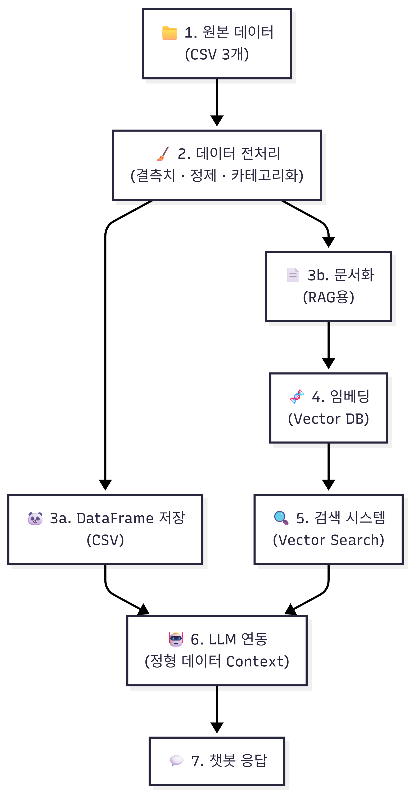
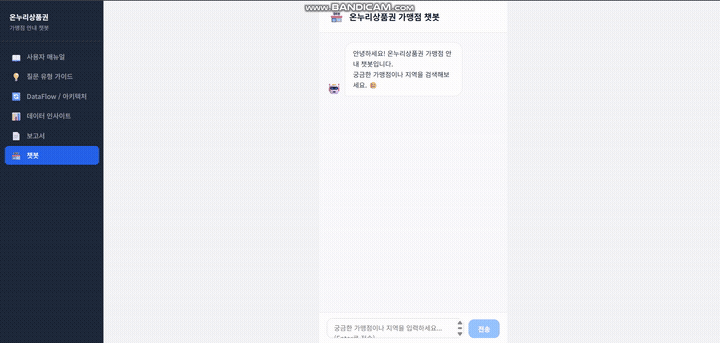
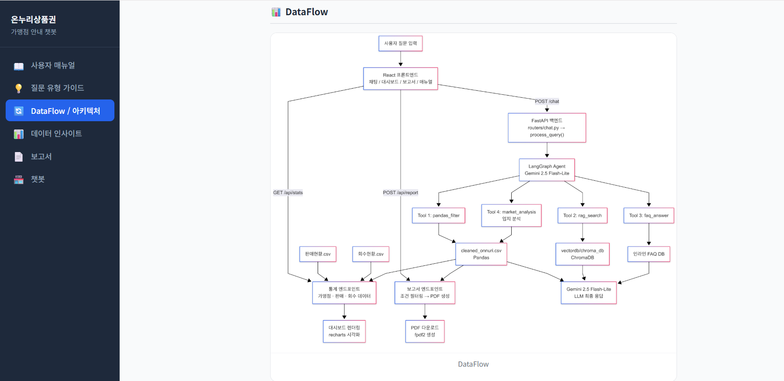
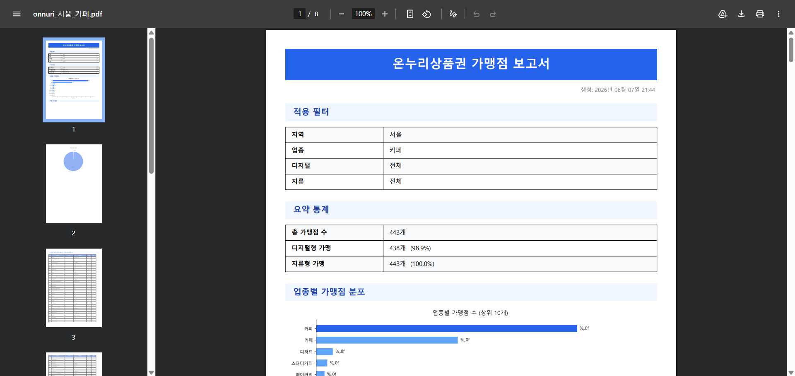
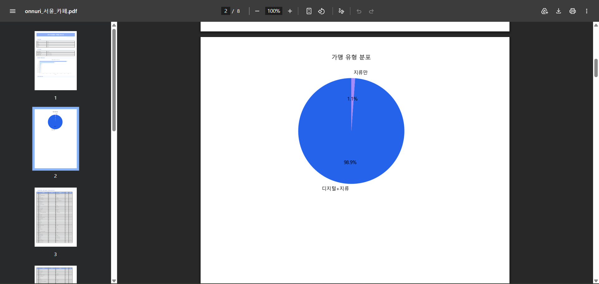
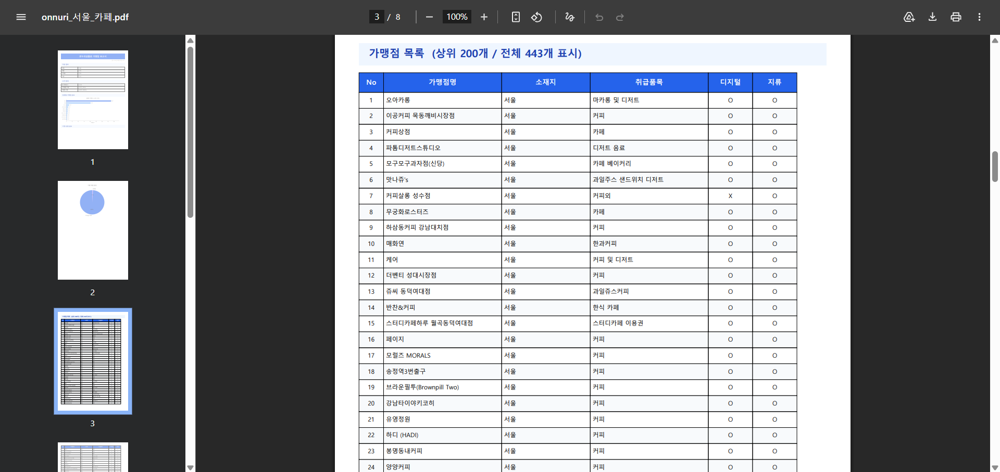
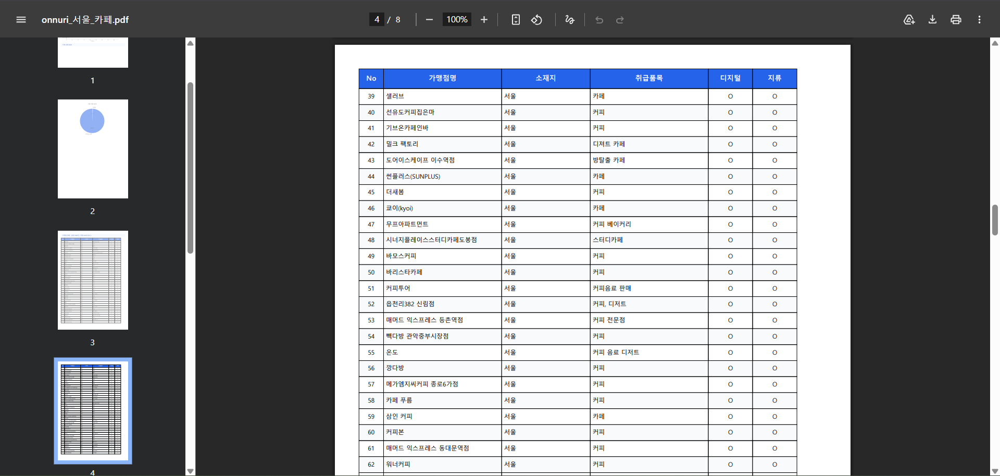

> **현재 리팩토링 진행중입니다.**

# 온누리상품권 가맹점 안내 챗봇

전국 온누리상품권 가맹점 데이터를 기반으로 자연어 질문에 답변하는 AI 챗봇 웹 애플리케이션입니다.  
LangGraph ReAct Agent + Gemini 2.5 Flash LLM을 활용하며, React SPA 프론트엔드와 FastAPI 백엔드로 구성됩니다.

---

## 주요 기능

| 기능 | 설명 |
|------|------|
| **AI 챗봇** | 지역·업종·디지털/지류 조건 검색, 자연어 유사도 검색, 상품권 정책 FAQ |
| **PDF 보고서 생성** | 조건 필터링 후 가맹점 목록과 차트(막대·파이)가 포함된 PDF 다운로드 |
| **데이터 인사이트** | 전국 17개 시도 가맹점 수·판매·회수 통계 대시보드 (Recharts) |
| **아키텍처 뷰어** | 시스템 아키텍처 및 DataFlow 다이어그램 + 요청 처리 흐름 설명 |
| **질문 가이드** | 챗봇에서 사용 가능한 질문 유형 예시 안내 |
| **사용자 매뉴얼** | 서비스 전체 사용 방법 안내 |

---

## 기술 스택

### 프론트엔드
- **React 18** — SPA 구성
- **Vite 5** — 빌드 도구 및 개발 서버
- **Recharts** — 데이터 시각화 (막대·선·파이 차트)
- **CSS Modules** — 컴포넌트별 스코프 스타일링

### 백엔드
- **FastAPI** — REST API 서버
- **Uvicorn** — ASGI 서버
- **Pydantic** — 요청/응답 데이터 검증
- **mcp** - MCP Server Tool 인터페이스
- **pandas** - 정형 데이터 검색/필터링

### AI / LLM
- **LangGraph** (`create_react_agent`) — Tool-calling ReAct Agent 구성
- **LangChain** — LLM 추상화, 벡터스토어 연동
- **Google Gemini 2.5 Flash Lite** — LLM (langchain-google-genai)
- **OpenAI text-embedding-3-small** — 가맹점 텍스트 임베딩

### 데이터 / 저장
- **Pandas** — 정형 데이터 필터링 및 통계
- **ChromaDB** — 로컬 벡터 데이터베이스 (MMR 검색)
- **CSV** — 전처리된 온누리 가맹점 원본 데이터

### 보고서
- **fpdf2** — PDF 생성 (한국어 맑은 고딕 폰트)
- **Matplotlib** — 업종별 막대 차트 및 가맹 유형 파이 차트

### 개발 도구
- **Jupyter Notebook** — 데이터 탐색 및 전처리 실험
- **python-dotenv** — 환경 변수 관리

---

## 디렉토리 구조

```
chatbot_project/
├── backend/                    # FastAPI 서버
│   ├── main.py                 # 앱 초기화, CORS, 라우터 등록
│   └── routers/
│       ├── chat.py             # POST /api/chat  — 챗봇 응답
│       ├── report.py           # GET  /api/report — PDF 보고서 생성
│       └── search.py           # GET  /api/search/* — MCP 기반 가맹점 검색
│
├── frontend/                   # React SPA (Vite)
│   ├── src/
│   │   ├── App.jsx             # 루트 컴포넌트, 페이지 라우팅
│   │   ├── components/
│   │   │   ├── Sidebar.jsx     # 사이드바 내비게이션
│   │   │   └── Chat.jsx        # 챗봇 UI (메시지 버블, 입력창)
│   │   └── pages/
│   │       ├── Manual.jsx          # 사용자 매뉴얼
│   │       ├── QuestionGuide.jsx   # 질문 유형 가이드
│   │       ├── Architecture.jsx    # DataFlow / 시스템 아키텍처
│   │       ├── DataInsights.jsx    # 데이터 인사이트 대시보드
│   │       └── Report.jsx          # 보고서 생성 (PDF 다운로드)
│   ├── index.html
│   └── package.json
│
├── src/                        # 핵심 비즈니스 로직
│   ├── chatbot.py              # LangGraph ReAct Agent + 3개 Tool 정의
│   ├── llm_config.py           # Gemini LLM / OpenAI Embeddings 설정
│   ├── search_engine.py        # 지역·시장명·복합 검색 함수, 통계 함수
│   ├── rag_setup.py            # ChromaDB 벡터DB 구축 스크립트
│   └── utils/
│       ├── project1_desc.py    # 프로젝트 설명 텍스트
│       ├── project2_desc.py
│       └── project3_desc.py
│
├── notebooks/
│   ├── 01_data_exploration.ipynb   # 기본 통계량 확인 및 EDA
│   └── 02_preprocessing.ipynb      # 전처리 및 cleaned_onnuri.csv 생성
│
├── mcp_server/                 # MCP 서버 클라이언트
├── vectordb/chroma_db/         # ChromaDB 벡터 데이터베이스 (git 제외)
├── docs/                       # 아키텍처 다이어그램, 실행 화면 이미지
│
├── cleaned_onnuri.csv          # 전처리 완료 가맹점 데이터 (~15만 건)
├── area_onnuri.csv             # 지역별 가맹점 요약 데이터
├── 가맹점_현황.csv              # 공공데이터 원본
├── 판매_현황.csv                # 지역별 연도별 판매 현황 원본
├── 회수_현황.csv                # 지역별 연도별 회수 현황 원본
│
├── .env                        # API 키 환경 변수 (git 제외)
├── requirements.txt            # Python 패키지 목록
└── README.md
```

---

## 시스템 아키텍처

```
[사용자 브라우저]
      │  React SPA (Vite :5173)
      │
      ▼
[FastAPI 백엔드 (:8000)]
      ├── POST /api/chat   →  src/chatbot.py
      │                        │
      │                   LangGraph ReAct Agent
      │                        ├── Tool 1: pandas_filter
      │                        │     └── cleaned_onnuri.csv (Pandas)
      │                        ├── Tool 2: rag_search
      │                        │     └── vectordb/chroma_db (ChromaDB)
      │                        └── Tool 3: faq_answer
      │                              └── 인라인 FAQ DB
      │                   Gemini 2.5 Flash (LLM 최종 응답)
      │
      ├── GET  /api/report  →  backend/routers/report.py
      │                         └── Pandas 필터 + Matplotlib 차트 + fpdf2 PDF
      │
      └── GET  /api/search/* →  backend/routers/search.py
                                  └── MCP 클라이언트 기반 검색
```

### 챗봇 요청 처리 흐름

1. React UI 질문 입력 → `POST /api/chat`
2. LangGraph Agent가 질문 유형 분석 → 적합한 Tool 선택
3. Tool 실행 (Pandas 필터링 / ChromaDB 유사도 검색 / FAQ 매칭)
4. Gemini 2.5 Flash가 Tool 결과를 바탕으로 자연어 답변 생성
5. JSON 응답 → React 채팅 버블 렌더링

### Agent Tool 구성

| Tool | 역할 | 사용 시점 |
|------|------|-----------|
| `pandas_filter` | 지역·품목·디지털/지류 조건 정형 필터링, 통계 집계 | 구체적인 조건 검색, 개수 질문 |
| `rag_search` | ChromaDB 벡터 유사도 검색 (MMR) | "분위기 좋은 카페" 등 자연어 묘사 |
| `faq_answer` | 상품권 정책·사용법·규정 FAQ | 유효기간, 환불, 할인율, 구입처 등 |

---

## RAG 파라미터 튜닝 실험 결과

> 실험 스크립트: `experiments/chunk_tuning.py` | 결과 데이터: `experiments/chunk_experiment.csv`

### 실험 조건

| 파라미터 | 테스트 값 | 고정값 |
|----------|-----------|--------|
| `chunk_size` | 500 / 1000 / 2000 | — |
| `k` (검색 문서 수) | 5 / 10 | — |
| `lambda_mult` (MMR 다양성) | — | **0.7** |
| 샘플 문서 수 | — | 5,000건 |
| 임베딩 모델 | — | `gemini-embedding-001` |

### 정확도 측정 기준

각 조합마다 고정 질문 5개를 실행하고, 검색된 문서가 해당 기준을 만족하는 비율을 정확도로 계산했습니다.

| 질문 | 정확도 판별 기준 |
|------|-----------------|
| "서울 음식점" | `소재지`에 "서울" 포함 |
| "경기 자전거 매장" | `소재지`에 "경기" 포함 |
| "디지털 가능한 카페" | `디지털형 가맹 여부 == Y` |
| "분위기 좋은 한식집" | `취급품목`에 한식 관련 키워드 포함 |
| "부산 카페" | `소재지`에 "부산" 포함 |

### 실험 결과

| chunk_size | k | 서울 음식점 | 경기 자전거 | 디지털 카페 | 한식집 | 부산 카페 | **평균** |
|:---:|:---:|:---:|:---:|:---:|:---:|:---:|:---:|
| 500 | **5** | 100% | 80% | 100% | 100% | 80% | **92%** |
| 500 | 10 | 90% | 90% | 100% | 100% | 70% | 90% |
| 1000 | **5** | 100% | 80% | 100% | 100% | 80% | **92%** |
| 1000 | 10 | 90% | 90% | 100% | 100% | 70% | 90% |
| 2000 | **5** | 100% | 80% | 100% | 100% | 80% | **92%** |
| 2000 | 10 | 90% | 90% | 100% | 100% | 70% | 90% |

### 변경 전/후 비교

| 설정 | chunk_size | chunk_overlap | k |
|------|:---:|:---:|:---:|
| **변경 전** (`rag_setup.py` 기존) | 1000 | 200 | 10 |
| **변경 후** (실험 결과 채택) | 500 | 100 | **5** |

| 질문 | 변경 전 (1000/k=10) | 변경 후 (500/k=5) | 변화 |
|------|:---:|:---:|:---:|
| 서울 음식점 | 90% | **100%** | +10% |
| 경기 자전거 매장 | 90% | 80% | -10% |
| 디지털 가능한 카페 | 100% | **100%** | 0% |
| 분위기 좋은 한식집 | 100% | **100%** | 0% |
| 부산 카페 | 70% | **80%** | +10% |
| **평균** | 90% | **92%** | **+2%** |

> **chunk_size 단독 효과 없음**: 가맹점 1건 텍스트가 평균 ~120자로 짧아 500·1000·2000 모두 실질 청킹이 일어나지 않아 chunk_size 변경에 따른 정확도 차이는 없었음.  
> **실질 개선 요인은 k 감소 (10 → 5)**: k가 작을수록 상위 유사도 문서만 반환되어 지역 일치율이 올라감. 서울·부산 쿼리에서 각 +10%p 개선, 평균 +2%p 상승.  
> 경기 자전거는 k=5에서 -10%p이지만, 검색 정밀도와 다양성 간 트레이드오프이며 평균 기준으로는 k=5가 우위.

### 결론 및 채택 파라미터

**채택: `chunk_size=500`, `chunk_overlap=100`, `k=5`, `lambda_mult=0.7`** (평균 정확도 92%, k=10 대비 +2%p)

---

## 실행 방법

### 1. 사전 준비

```bash
# conda 가상환경 생성 및 활성화
conda create -n new_env python=3.11
conda activate new_env

# Python 패키지 설치
pip install -r requirements.txt

# Node.js 패키지 설치 (프론트엔드)
cd frontend
npm install
cd ..
```

### 2. 환경 변수 설정

프로젝트 루트에 `.env` 파일 생성:

```env
OPENAI_API_KEY=sk-...
GOOGLE_API_KEY=AIza...
```

### 3. 벡터DB 구축 (최초 1회)

```bash
# 노트북으로 데이터 전처리
jupyter notebook
# 순서: 01_data_exploration.ipynb → 02_preprocessing.ipynb

# 벡터DB 생성 (약 10~20분, OpenAI API 비용 약 $0.30)
python -m src.rag_setup
```

> `vectordb/chroma_db/` 가 이미 존재하면 기존 DB를 재사용합니다.

### 4. 서버 실행

터미널 1 — 백엔드:

```bash
uvicorn backend.main:app --reload
```

터미널 2 — 프론트엔드 개발 서버:

```bash
cd frontend
npm run dev
```

브라우저에서 `http://localhost:5173` 접속

---

## API 엔드포인트

| Method | Path | 설명 |
|--------|------|------|
| `POST` | `/api/chat` | 챗봇 질문 처리 |
| `GET` | `/api/report` | PDF 보고서 생성 및 다운로드 |
| `GET` | `/api/search/area` | 지역 기반 가맹점 검색 |
| `GET` | `/api/search/name` | 시장명 기반 검색 |
| `GET` | `/api/search/combined` | 지역+시장명 복합 검색 |
| `GET` | `/api/search/stores` | 지역·업종·디지털 복합 검색 |
| `GET` | `/api/search/statistics` | 지역 통계 조회 |
| `GET` | `/health` | 서버 상태 확인 |

### POST /api/chat 요청 예시

```json
{
  "message": "서울 디지털 가능한 음식점 알려줘",
  "history": [["이전 질문", "이전 답변"]]
}
```

### GET /api/report 파라미터

| 파라미터 | 타입 | 예시 | 설명 |
|----------|------|------|------|
| `region` | string | `서울` | 지역명 (빈 값 = 전체) |
| `category` | string | `카페` | 업종 (빈 값 = 전체) |
| `digital_only` | bool | `true` | 디지털 가맹점만 |
| `paper_only` | bool | `false` | 지류 가맹점만 |

---

## 데이터

### cleaned_onnuri.csv 주요 컬럼

| 컬럼명 | 설명 |
|--------|------|
| `가맹점명` | 상호명 |
| `소재지` | 주소 (지역 필터 기준) |
| `취급품목` | 업종 분류 |
| `디지털형 가맹 여부` | `Y` / `N` |
| `지류형 가맹 여부` | `Y` / `N` |
| `소속 시장명(또는 상점가)` | 소속 전통시장명 |

- 전국 약 **15만 건** 가맹점 데이터
- 원본: 공공데이터포털 소상공인시장진흥공단 제공

---

## 주의사항

- **벡터DB** (`vectordb/chroma_db/`): 용량 약 500MB~1GB, git 추적 제외
- **API 키**: `.env` 파일은 git에 포함하지 않음. OpenAI·Google API 키 모두 필요
- **한국어 PDF**: Windows 맑은 고딕 폰트 (`C:\Windows\Fonts\malgun.ttf`) 사용 — Windows 환경 전용

---

## 데이터 플로우

### 리팩토링 전
DataFlow<br>
<p align="center">
  
</p>

### 리팩토링 후
리팩토링 DataFlow<br>
<p align="center">
  
</p>

## 시스템 아키텍처 다이어그램

### 리팩토링 전
시스템 아키텍처<br>
<p align="center">
  
</p>

### 리팩토링 후
리팩토링 시스템 아키텍처<br>
<p align="center">
  
</p>

## 시연 영상

<p align="center">
  
</p>

---

## 실행 화면

### 리팩토링 전
RAG 기반 추천 답변<br>
<p align="center">
  
</p>
지역+업종 답변 <br>
<p align="center">
  
</p>
지역별 가맹점 수<br>
<p align="center">
  
</p>

지역별 업종 비율<br>
<p align="center">
  
</p>

### 리팩토링 후

사용자 매뉴얼<br>
<p align="center">
  
</p>

사용자 매뉴얼(2)<br>
<p align="center">
  
</p>

질문 유형 가이드<br>
<p align="center">
  
</p>

질문 유형 가이드(2)<br>
<p align="center">
  
</p>

시스템 아키텍처<br>
<p align="center">
  
</p>

DataFlow<br>
<p align="center">
  
</p>

데이터 인사이트<br>
<p align="center">
  
</p>

데이터 인사이트(2)<br>
<p align="center">
  
</p>

보고서 생성<br>
<p align="center">
  
</p>

보고서1pg<br>
<p align="center">
  
</p>

보고서2pg<br>
<p align="center">
  
</p>

보고서3pg<br>
<p align="center">
  
</p>

보고서4pg<br>
<p align="center">
  
</p>

디지털 상품권 불가능 가맹점 질문<br>
<p align="center">
  
</p>

RAG 기반 추천 답변<br>
<p align="center">
  
</p>

지역 + 업종 + 디지털 사용 가능여부<br>
<p align="center">
  
</p>

지역 업종 통계<br>
<p align="center">
  
</p>

디지털 상품권 안되는 곳<br>
<p align="center">
  
</p>

지역 + 업종 추천 답변<br>
<p align="center">
  
</p>

서울 업종 카페 추천<br>
<p align="center">
  
</p>

정책 검색<br>
<p align="center">
  
</p>

상품권 사용처 유효기간<br>
<p align="center">
  
</p>
